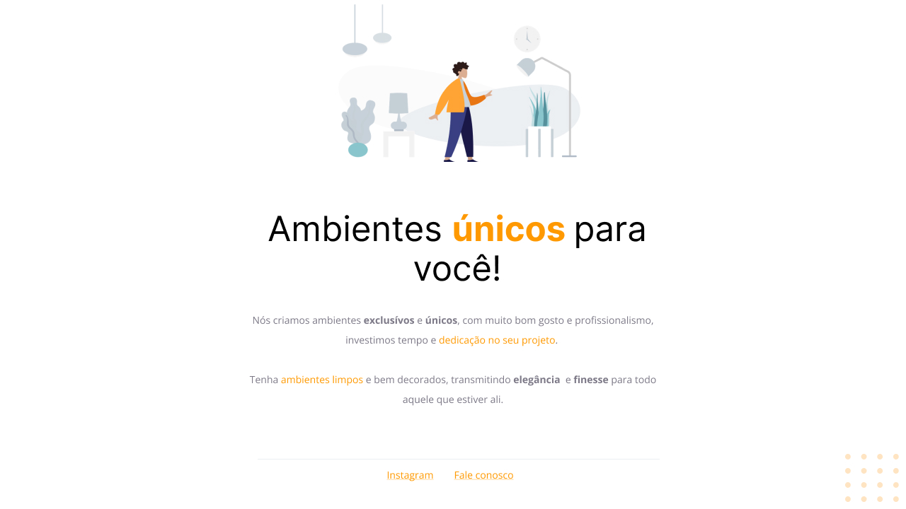

<h1 align="center">Corrigindo bugs (01) 👀</h1>

# 💻 Sobre o desafio

Nesse desafio, recebi um código com o projeto desenvolvido durante as aulas da Fase 01.
Mas, a surpresa vem aí...  **👀**  
O código sofreu algumas alterações e, como podemos ver na imagem abaixo, ele não está mais da mesma forma que o Maykão deixou no Figma.

  <a href="#-tecnologias">Tecnologias</a>&nbsp;&nbsp;&nbsp;|&nbsp;&nbsp;&nbsp;
  <a href="#-projeto">Projeto</a>&nbsp;&nbsp;&nbsp;|&nbsp;&nbsp;&nbsp;
  <a href="#-layout">Layout</a>&nbsp;&nbsp;&nbsp;|&nbsp;&nbsp;&nbsp;
  <a href="#memo-licença">Licença</a>

 
Antes da refaturação do código, o projeto se encontrava assim:
 

  

 

 
Após a refaturação o projeto ficou assim, seguindo as orientações do Figma:
 

  

## 🚀 Tecnologias

Esse projeto foi desenvolvido com as seguintes tecnologias:
- Figma
- HTML e CSS
- Git e Github
- VS Code

## 💻 Projeto

Pagina simples de uma empresa de Design de interiores.

## 🔖 Layout

Você pode visualizar o layout do projeto através [DESSE LINK](https://www.figma.com/file/sKcov5TgSQKbdt9SQOdg0v/Explorer---Projeto-01-(Copy)?node-id=1%3A2&t=7W6eCamWvIPCCtcH-0). É necessário ter conta no [Figma](https://figma.com) para acessá-lo.

